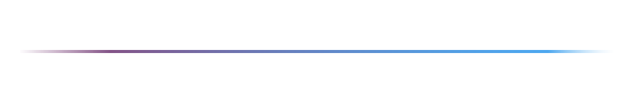
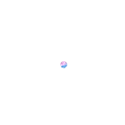

# 🎯 Genshin Impact — Gacha Chances Heatmap

  

**Интерактивная heatmap** — простая таблица, которая показывает, какой процент шанса на выпадение легендарного персонажа/оружия у тебя **сейчас**, в зависимости от того, сколько круток (wish / молитв) ты уже сделал(а) на баннере.

> Таблица — не предсказание, а визуализация: она помогает быстро понять, как растёт вероятность и в какую цветовую зону попадает текущая крутка.

---

## ✨ Что показывает таблица (простыми словами):
- Для **баннера персонажей** мы считаем: **100% = 90 круток**.
- Для **баннера оружия**: **100% = 80 круток**.
- Ячейки нумеруются от `1` до `90` (или до `80`) — каждая ячейка показывает, сколько круток и какой это процент от гарантии.
- Цветовая шкала: **зелёное = хорошо (маленькое количество круток)** → **красное = плохо (много круток)**.

---

## 📘 Пример (чтобы всё было наглядно):
Представим, ты хочешь сделать **75-ую крутку** на баннере персонажей (где 90 = 100%):

1. Считаем точный процент:
    - 75/90*100 = 83.3333333333%
    - округляем до сотых, шанс: **83.33%**

2. Что будет на следующей (76-й) крутке:
    - 75/90*100 = 84.4444444444
    - округляем до сотых, шанс: **84.44%**

Именно такую информацию ты увидишь в таблице: текущую ячейку (75) и следующую (76) с соответствующими процентами и цветом.

---

## 🧭 Как читается:
- **Чем меньше круток (зелёная зона)** — тем лучше результат. **Хорошо.**
- **Чем больше круток (красная зона)** — тем хуже результат. **Плохо.**

(В правой части страницы есть наглядная полоса-легенда — от зелёного к красному.)

---

## 🔗 Полезные ссылки на сторонние ресурсы:
Если ты хочешь узнать, **сколько круток сделано (автоподсчет)**:
- Используй [paimon.moe — Wish Tracker](https://paimon.moe/wish).  
  На странице есть «Счетчик молитв», который подтягивает историю круток из игры и показывает, сколько по факту тобой уже сделано круток или сколько было сделано ранее до выпадения уже полученных легендарок.

> Примечание: `paimon.moe` — внешний сервис и **не связан с HoYoverse**. Проект не хранит твоих игровых данных.
> 
> Если нужно подтянуть статистику, переходи по ссылке и следуй инструкциям на их сайте.
> 
>> *`paimon.moe` никакой связи с текущим проектом не несет.

---
## ⚠️ Важно:
> **Проект не является официальным продуктом HoYoverse**.  
Genshin Impact, её персонажи, арты, механики и другие материалы — **товарные знаки и собственность HoYoverse**.  
>Весь контент в этом проекте создан исключительно в образовательных и демонстрационных целях.

  

